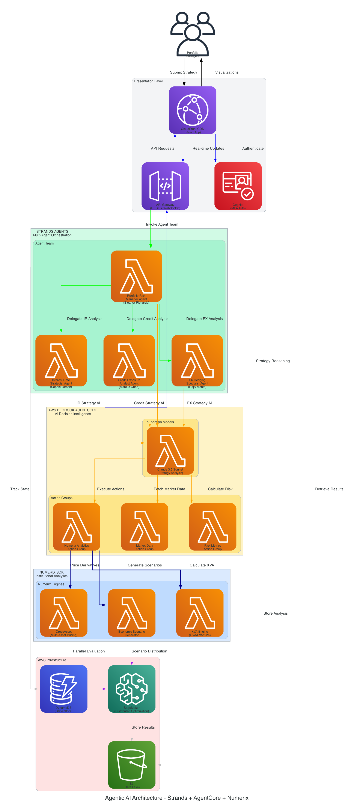

# AgenticNumerix: AI-Powered Financial Risk Analytics

> **Transforming financial analytics through intelligent agent orchestration with the Numerix SDK**



**Workflow:** Portfolio managers submit optimization requests through a React frontend, triggering a sophisticated multi-agent orchestration system powered by Strands Agents. Specialized AI agents (Portfolio Risk Manager, FX Specialist, Interest Rate Strategist, Credit Analyst) collaborate through AWS Bedrock AgentCore, leveraging Claude 3.5 Sonnet for intelligent decision-making. These agents invoke custom action groups that call Numerix SDK analytics (CrossAsset pricing, Economic Scenario Generator, XVA calculations) to evaluate strategies across thousands of market scenarios. SageMaker distributes the computational workload across multiple instances, processing results in parallel, while S3 and DynamoDB persist data and agent state. The entire workflow—from strategy submission to comprehensive analysis with visualizations—completes in minutes rather than the weeks required for manual analysis, enabling portfolio managers to discover optimal allocation strategies that maintain robustness across varying market conditions.

## 🚀 Overview

AgenticNumerix demonstrates the integration of **Numerix's financial analytics platform** with **agentic AI systems**. This repository shows how autonomous AI agents can leverage Numerix's suite of pricing models, risk analytics, and scenario generation capabilities to solve complex financial challenges across trading, risk management, asset management, and corporate treasury operations.

## 🌟 Why Numerix + Agentic AI?

### The Numerix Advantage
- **40+ years** of quantitative finance innovation
- **2,000+ mathematical models** for derivatives pricing and risk analytics
- **Real-time cross-asset analytics** across equities, fixed income, FX, commodities, and credit
- **Enterprise-grade architecture** trusted by the world's leading financial institutions
- **Regulatory compliance** with Basel III, IFRS 9, Solvency II, and other frameworks

### The Agentic AI Revolution
- **Multi-agent orchestration** enabling complex decision workflows
- **Domain-specific expertise** through specialized agent personas
- **Real-time collaboration** between risk managers, traders, and strategists
- **Scalable cloud deployment** processing thousands of scenarios simultaneously
- **Continuous learning** and adaptation to market conditions

## 💡 Featured Use Cases

### 🏛️ Multi-Agent Trading & Structuring
- **[Exotic Options Structuring Syndicate](./03-ExoticOptionsStructuringSyndicate.md)** - AI agents designing bespoke barrier options with real-time pricing via Numerix CrossAsset
- **[Multi-Asset Hedging Orchestra](./04-MultiAssetHedgingOrchestra.md)** - Coordinated FX, rates, and credit hedging for complex liability structures
- **[Convertible Bond Arbitrage Team](./06-ConvertibleBondArbitrageTeam.md)** - Systematic convertible screening and delta-hedging optimization

### 🛡️ Multi-Agent Risk Management
- **[Real-Time Risk Surveillance Network](./08-Real-TimeRiskSurveillanceNetwork.md)** - Continuous monitoring of 10,000+ positions with sub-second VaR updates
- **[Climate Risk Scenario Planning](./09-ClimateRiskScenarioPlanningConsortium.md)** - 100+ climate scenarios across 25-year horizons for structured credit portfolios
- **[Dynamic XVA Optimization Squad](./10-DynamicXVAOptimizationSquad.md)** - Real-time CVA, FVA, and capital optimization across 20,000+ derivatives

### 📊 Multi-Agent Asset Management
- **[Structured Products Innovation Lab](./11-Structured%20Products%20Innovation%20Lab.md)** - Automated design and testing of 75+ autocallable variations
- **[Alternative Risk Premia Harvesting](./13-AlternativeRiskPremiaHarvestingCollective.md)** - Systematic capture of risk premia across 200+ signals
- **[Multi-Manager Fixed Income Engine](./12-Multi-ManagerFixedIncomeAllocationEngine.md)** - Optimized allocation across 25 managers and 500+ securities

### 🏢 Corporate Treasury & Regulatory
- **[Corporate Treasury Optimization](./16-CorporateTreasuryOptimizationCommand.md)** - Multinational FX hedging and funding cost optimization
- **[Basel III Capital Optimization](./32-BaselIIICapitalRatioOptimizationEngine.md)** - Trading book capital efficiency through portfolio construction
- **[Solvency II SCR Laboratory](./34-SolvencyIISolvencyCapitalRequirementLaboratory.md)** - Insurance capital requirement calculation across 300+ scenarios

### ⚡ Cloud-Scale Stress Testing
- **[Global Macro Storm Testing](./20-GlobalMacroScenarioStormTesting.md)** - 500+ macroeconomic scenarios for multi-billion dollar pension funds
- **[Volatility Regime Laboratory](./24-VolatilityRegimeShiftLaboratory.md)** - Options portfolio testing across 300+ volatility surface scenarios
- **[Counterparty Contagion Analysis](./28-CounterpartyContagionNetworkAnalysis.md)** - Credit contagion modeling across 500+ counterparty networks

## 🛠️ Technical Architecture

### High-Level Architecture


The platform combines three key technologies in a layered architecture:

1. **🟢 Strands Agents** - Multi-agent orchestration with specialized personas (Portfolio Manager, FX Specialist, IR Strategist, Credit Analyst)
2. **🟡 AWS Bedrock AgentCore** - AI decision intelligence powered by Claude 3.5 Sonnet with custom action groups
3. **🔵 Numerix SDK** - Institutional-grade financial analytics (CrossAsset, Economic Scenario Generator, XVA Engine)
4. **🔴 AWS Infrastructure** - Scalable cloud compute (SageMaker, Lambda) and storage (S3, DynamoDB)

### Agent Framework Integration
```python
from bedrock_agentcore import BedrockAgentCoreApp
from strands import Agent
from numerix import CrossAsset, EconomicScenarioGenerator

app = BedrockAgentCoreApp()

@app.entrypoint
def risk_analyst_agent(request):
    # Leverage Numerix analytics in agent workflows
    scenario_results = EconomicScenarioGenerator.run(
        scenarios=request.get("scenarios"),
        horizon=request.get("horizon")
    )
    return scenario_results
```

### Numerix SDK Capabilities
- **CrossAsset**: Unified pricing and risk analytics across all asset classes
- **Economic Scenario Generator**: Forward-looking scenario modeling for stress testing
- **PolyPaths**: Advanced fixed income and structured product analytics
- **Kynex**: Convertible bond and equity-linked derivatives analytics
- **XVA**: Comprehensive valuation adjustments and regulatory capital

## 📈 Business Impact

### Quantified Benefits
- **25bp funding cost savings** through optimized corporate treasury strategies
- **300bp capital efficiency improvement** in variable annuity hedging programs
- **15-25bp revenue margin** on $500M structured product transactions
- **50bp cost savings** through multi-asset pension fund hedging optimization
- **200bp capital efficiency** improvement in trading book risk management

### Operational Excellence
- **Sub-second risk updates** across 10,000+ position portfolios
- **Real-time pricing** of 50+ barrier option variations simultaneously
- **24/7 autonomous monitoring** with intelligent escalation workflows
- **Regulatory compliance** automation for Basel III, IFRS 9, Solvency II

## 🔒 Security & Compliance

**Enterprise-Grade Security with SOC2 Type II Certification**

This platform is designed to meet the highest security and compliance standards required by financial institutions:

### SOC2 Type II Compliance
- ✅ **Complete Trust Service Criteria** (CC1-CC9) implementation
- ✅ **Data Encryption** at rest (AES-256) and in transit (TLS 1.3)
- ✅ **Multi-factor Authentication** for all privileged access
- ✅ **Audit Logging** with 7-year retention (CloudTrail, VPC Flow Logs)
- ✅ **Disaster Recovery** with RTO < 4 hours, RPO < 1 hour
- ✅ **Automated Compliance** monitoring and alerting
- ✅ **Annual External Audits** for SOC2 Type II certification

### NY DFS Cybersecurity Regulation (23 NYCRR 500)
For financial institutions operating in New York State:
- ✅ **Risk Assessment** with documented cybersecurity programs
- ✅ **Access Controls** with least-privilege and MFA enforcement
- ✅ **Data Encryption** for all nonpublic information
- ✅ **Incident Response** plan with 72-hour breach notification
- ✅ **Vendor Management** with third-party security assessments
- ✅ **Annual Certification** by qualified individual
- ✅ **Penetration Testing** and vulnerability assessments

### Additional Financial Compliance
- **PCI DSS** - Payment card data security (if applicable)
- **GDPR/CCPA** - Data privacy and subject rights
- **GLBA** - Financial privacy requirements
- **SEC/FINRA** - Recordkeeping and data retention

📄 See [SOC2 Compliance Requirements](Documents/SOC2_COMPLIANCE_REQUIREMENTS.md) and [NY DFS Compliance](Documents/NYDFS_COMPLIANCE_REQUIREMENTS.md) for complete details.

## 🚀 Getting Started

### Prerequisites
- Numerix SDK license and installation
- Python 3.8+ environment
- AWS Account with SOC2-compliant configuration
- AWS Bedrock AgentCore SDK (optional for cloud deployment)
- Strands Agents framework (optional for multi-agent orchestration)

### Security-First Deployment
1. **Validate Compliance** - Run automated SOC2 compliance checker
   ```bash
   python3 utils/soc2_compliance_checker.py --profile <aws-profile> --account <account-id>
   ```

2. **Clone the repository**
   ```bash
   git clone https://github.com/skrinak/AgenticNumerix.git
   cd AgenticNumerix
   ```

3. **Configure Security** - Set up environment variables
   ```bash
   cp platform/.env.example platform/.env
   # Edit .env with your AWS credentials and configuration
   ```

4. **Deploy Infrastructure** - Follow Phase 0 (SOC2 Foundation) in deployment tasks
   ```bash
   # See Documents/TASKS_AWS_DEPLOYMENT.md
   # Phase 0: SOC2 Compliance Foundation (MANDATORY)
   ```

5. **Explore Use Cases** - Each markdown file contains detailed implementations with:
   - Agent persona descriptions and responsibilities
   - Real-world scenario narratives
   - Technical implementation details
   - Business impact quantification
   - Security and compliance considerations

6. **Adapt for Your Organization** - Use the provided patterns to build SOC2-compliant agentic workflows

## 📊 Resources & Documentation

### Presentation Materials
Comprehensive materials for executive briefings, investment committees, and technical deep dives:

- **[Executive Summary](Documents/Presentation/EXECUTIVE_SUMMARY.md)** - High-level business value overview for C-Suite and board members. Includes ROI analysis ($15M+ annual value creation), strategic implications, and competitive differentiation. (~15 pages, 30-minute read)

- **[Technical Architecture](Documents/Presentation/TECHNICAL_ARCHITECTURE.md)** - Detailed system architecture with ASCII diagrams, data flow sequences, and infrastructure specifications. Covers three-layer intelligence (Numerix → Agents → Claude), scalability characteristics, and disaster recovery. For CTOs and technology leaders. (~20 pages, 45-minute read)

- **[ROI Calculation](Documents/Presentation/ROI_CALCULATION.md)** - Comprehensive financial analysis with conservative, realistic, and aggressive scenarios. Demonstrates 15:1 to 75:1 ROI depending on portfolio size, with complete value creation breakdown across performance, risk mitigation, and operational efficiency. For CFOs and investment committees. (~25 pages, 60-minute read)

- **[Presentation Outline](Documents/Presentation/PRESENTATION_OUTLINE.md)** - Slide-by-slide guide with speaker notes, demo flow, and Q&A preparation. Includes 45-minute presentation structure, live demo script, and customization guidance for different audiences. For presenters and internal teams. (~30 pages)

### Technical Documentation
- **[Notebook Explained](Documents/NOTEBOOK_EXPLAINED.md)** - Comprehensive technical analysis of the dynamic asset allocation notebook, including architecture, algorithms, and implementation details
- **[AWS Deployment Tasks](Documents/TASKS_AWS_DEPLOYMENT.md)** - Complete infrastructure deployment checklist with Phase 0 (SOC2 Foundation) requirements
- **[React Frontend Tasks](Documents/TASKS_REACT_FRONTEND.md)** - Web interface implementation guide with Redux state management and component architecture

### Data & Use Cases
- **[Complete Use Case Catalog](./NumerixUseCases.csv)** - 42 detailed scenarios across trading, risk, and asset management
- **[Interactive Jupyter Notebook](multi_asset_hedging_sagemaker.ipynb)** - Live demonstration of hyperparameter optimization with agentic AI
- **Configuration Files** - Sample Numerix configuration for cloud deployment

## 🤝 Contributing

We welcome contributions that showcase innovative applications of Numerix analytics with agentic AI systems. Please ensure all contributions:
- Demonstrate real-world financial use cases
- Include quantified business benefits
- Follow enterprise security and risk management best practices
- Provide clear implementation guidance

## 📞 Connect

**Interested in building agentic AI solutions with Numerix?**
- Explore [Numerix's analytics platform](https://numerix.com)
- Learn about [AWS Bedrock AgentCore](https://aws.amazon.com/bedrock/agents/)
- Discover [Strands multi-agent framework](https://strands.ai)

---

*"The future of financial analytics is autonomous, intelligent, and powered by the capabilities of the Numerix platform. AgenticNumerix shows you how to build that future today."*

**Transform your financial analytics. Deploy intelligent agents. Unlock new insights.**